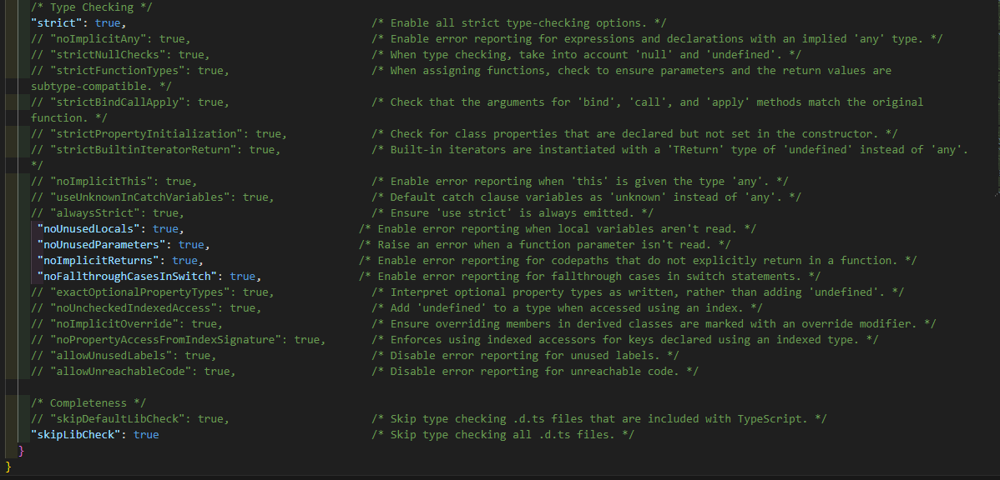

### `npm init -y`

El comando `npm init -y` crea un archivo `package.json` en el directorio actual utilizando valores predeterminados, sin necesidad de responder preguntas interactivas.

#### Detalles:

-   El flag `-y` (o `--yes`) omite el asistente de configuración y utiliza valores por defecto, como:
    -   `"name": "nombre-del-directorio"`
    -   `"version": "1.0.0"`
    -   `"main": "index.js"`
    -   `"license": "ISC"`

#### ¿Para qué sirve?

Es útil para inicializar rápidamente un proyecto Node.js sin configuraciones personalizadas.

### `npm install typescript -D`

El comando `npm install typescript -D` instala TypeScript como una **dependencia de desarrollo** en tu proyecto.

#### Detalles:

-   **`typescript`**: Incluye el compilador y herramientas de TypeScript.
-   **`-D`**: Indica que es una dependencia solo para desarrollo.

#### Resultado:

-   Instala TypeScript en `node_modules`.
-   Agrega `"typescript"` a `"devDependencies"` en el `package.json`.

#### ¿Para qué sirve?

Habilita el uso de TypeScript para escribir código con tipado estático y compilarlo a JavaScript. Ideal para proyectos más robustos.

### Añadiendo script "tsc" 

Permite transformar los ficheros de typescript a javascript

```
"scripts": {
    "tsc": "tsc",
    "test": "echo \"Error: no test specified\" && exit 1"
  },
```

### `npm run tsc -- --init`

Este comando inicializa un archivo de configuración de TypeScript (`tsconfig.json`) en tu proyecto.

#### Detalles:

-   **`npm run tsc`**: Ejecuta el compilador de TypeScript (`tsc`) instalado en el proyecto.
-   **`-- --init`**: Pasa el argumento `--init` al compilador, que genera un archivo `tsconfig.json` con opciones predeterminadas.

#### ¿Qué hace?

Crea un archivo `tsconfig.json` donde puedes configurar las opciones del compilador TypeScript, como el directorio de salida, reglas de sintaxis y soporte de módulos.

### CONFIGURANDO EL DIRECTORIO `outDir`

Este será el fichero donde typescript dejará todos los archivos compilados

```
 "outDir": "./build", 
```

Desde aqui se pueden realizan diversos tipos de configuración respecto al nivel de restricciones, incluyendo el tipado, se puede dejar por defecto si no cambiamos esta linea `strict:true,`




### `npm run tsc`

Ejecutamos este comando para que se compile todo el proyecto dentro un archivo index.js en una carpeta llamada build la cual se genera automaticamente si se han realizado bien todos los pasos.

### Añadiendo comando start

Despues de haber compilado el proyecto y haber obtenido el index.js, podemos ejecutarlo usando el comando node pero es mucho más cómodo hacerlo con un comando "start" que podemos añadir en los script

```
"scripts": {
    "start": "node build/index.js",
    "tsc": "tsc",
    "test": "echo \"Error: no test specified\" && exit 1"
  },
```

### Añadiendo comando dev

Una vez instalando la dependencia `ts-node-dev`, usaremos el comando `dev` para ejecutar el projecto y que se adapte a los cambios mientras esté activo, tal y como se suele hacer con nodemon, solo que añade un paso extra, el cual es **compilar**

```
"scripts": {
    "dev": "ts-node-dev src/index.ts",
    "start": "node build/index.js",
    "tsc": "tsc",
    "test": "echo \"Error: no test specified\" && exit 1"
  },
```

### Añandiendo herramienta de linteo

Una vez instalado la dependencia `ts-standard`, modificaremos el `package.json`.

```
"scripts": {
    "dev": "ts-node-dev src/index.ts",
    "lint":"ts-standard --fix"",
    "start": "node build/index.js",
    "tsc": "tsc",
    "test": "echo \"Error: no test specified\" && exit 1"
  },
```
Tambien añadiremos la siguiente configuracion para que se muestren las indicaciones dentro de los mismos ficheros

```
"dependencies": {
    "express": "4.21.2"
  },
  "eslintConfig": {
    "parserOptions": {
      "project":"./tsconfig.json"
    },
    "extends":["./node_modules/ts-standard/eslintrc.json"]
  }
  ```

Una vez realizada esta configuracion, podemos ejecutar el comando `npm run lint` para que se apliquen las modificaciones automaticamente, por ejemplo:

Antes:
```
const diaries: Array<DiaryEntry> = diaryData as Array<DiaryEntry>;
```
Despues:
```
const diaries: DiaryEntry[] = diaryData as DiaryEntry[]
```

Esto es solo una recomendación para obtener un código más corto y facil de entender. Ambas formas son exactamente la misma, pero en la segunda se aplican reglas de linting

>**Nota:** Este comando reestructura partes de tu código, es recomendable desactivar el autoguardado para verificar los cambios y guardarlos tú mismo o en su defecto, usar un control de versiones con git

