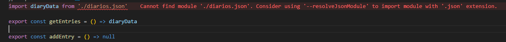
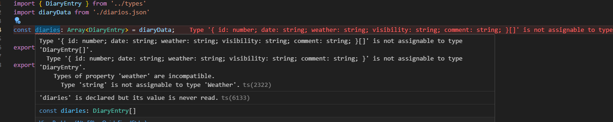

### `--resolveJsonModule`



`Cannot find module './diarios.json'. Consider using '--resolveJsonModule' to import module with '.json' extension.ts(2732)`

El error ocurre porque TypeScript no permite importar archivos JSON por defecto. Para solucionarlo, debes habilitar la opción resolveJsonModule en el archivo `tsconfig.json`. Esto permite que TypeScript reconozca y cargue módulos con extensión .json.

```
"resolveJsonModule": true
```

Esto ocurre debido a la inferencia de datos, es decir, una vez habilitado el `resolveJsonModule`, typescript asumirá el tipado de lo que esté retornando dicho json, sin embargo, esto no es lo más prudente.

Para ello, podemos definir el tipado en un archivo llamado `types.d.ts` el cual se encontrará dentro de nuestra carpeta `src/` ya que es el archivo que typescript busca por defecto.

### `type assertion`

La aserción de tipos o afirmación de tipo es similar a un casteo, en el cual le confirmamos a typescript que un dato tendrá si o si el tipado que estamos esperando al momento de asignarlo a nuestra variable.



Este tipo de problemas es recomendable leerlo de abajo hacia arriba, podemos notar que uno de los campos choca debido a que typescript lo reconoce como un string en el json pero nosotros lo hemos definido en nuestra interface como un type llamado Weather dentro de `types.d.ts` para ello realiza lo siguiente:

```
const diaries: Array<DiaryEntry> = diaryData as Array<DiaryEntry>;
```

tambien se puede declarar de la siguiente forma:
```
const diaries: Array<DiaryEntry> = <Array<DiaryEntry>>diaryData;
```
El funcionamiento es el mismo, typescript tiene ambas sintaxis para este caso. Ejemplo:
```
let nombre:any = "Dante"

let nombreStr = nombre as string;
let nombreStr2 = <string>nombre;

Tanto nombreStr como nombreStr2 son exactamente lo mismo.
```

>**Nota:** Siempre trata de evitar usar la aserción de tipos, en este caso, se usó debido a que era necesario ya que no podemos controlar del todo la información que se obtiene de un json.


### `Typescript no funciona en Runtime`

Typescript solo funciona en tiempo de compilado (de forma estatica), no durante desarrollo, por lo tanto, si tenemos el siguiente caso en `types.d.ts` en el cual queremos un type que explica algun campo de nuestra interface, hacemos lo siguiente:

```
export interface DiaryEntry {
  id: number
  date: string
  weather: Weather
  visibility: Visibility
  comment: string
}

export type NonSensitiveInfoDiaryEntry = Omit<DiaryEntry,'comment'>;
```

Si bien es cierto que esto excluye a "comment" de las propiedades esperadas, no se filtra automaticamente, es por ello que al aplicarlo en nuestros servicios, debemos mapear la entidad original, de manera que se excluya el campo "comment"
```
export const getEntriesWithoutSensitiveInfo = (): NonSensitiveInfoDiaryEntry[] => {
        return diaries.map(
            ({ id, date, weather, visibility }: DiaryEntry) => 
            ({id,date,weather,visibility})
    )
};
```

tambien podemos excluir dicho campo de la siguiente manera:
```
export const getEntriesWithoutSensitiveInfo = (): NonSensitiveInfoDiaryEntry[] => {
    return diaries.map(
        ({ comment, ...rest }: DiaryEntry) => rest
    )
};
```

### `archivo de definicion types.d.ts`

el archivo `types.d.ts` es un archivo de definicion, esto quiere decir, que dentro de este archivo solo puede ir código relacionado al tipado, no otros estructura que se ejecutan en runtime. por ejemplo:

```
export enum Weather {
  Sunny = 'sunny',
  Rainy = 'rainy',
  Cloudy = 'cloudy',
  Windy = 'windy',
  Stormy = 'stormy'
}

export enum Visibility {
  Great = 'great',
  Good = 'good',
  Ok = 'ok',
  Poor = 'poor'
}

export interface DiaryEntry {
  id: number
  date: string
  weather: Weather
  visibility: Visibility
  comment: string
}

export type NonSensitiveInfoDiaryEntry = Omit<DiaryEntry,'comment'>;
export type newDiaryEntry = Omit<DiaryEntry,'id'>;
```

En el `types.d.ts` no podrian ir los enum ya que corren en runtime, es decir, se convierten en un objeto de js, si tratamos de correr el proyecto con este contenido, nos saldrá error. Podriamos cambiar el nombre del archivo a `types.ts` pero no es lo que buscamos. Lo correcto seria separar el contenido, los enum en otro archivo `enum.ts` y el resto del codigo en el `type.d.ts` 

```
import { Weather, Visibility } from "./enum"

export interface DiaryEntry {
  id: number
  date: string
  weather: Weather
  visibility: Visibility
  comment: string
}

export type NonSensitiveInfoDiaryEntry = Omit<DiaryEntry,'comment'>;
export type newDiaryEntry = Omit<DiaryEntry,'id'>;
```